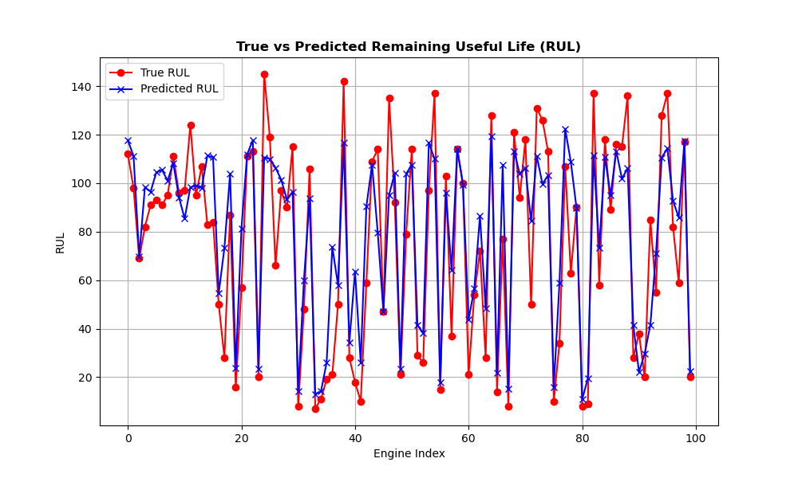

# 📘 Predictive Maintenance for Turbofan Engine RUL(Remaining Useful Life) Estimation

# ⚠️ Disclaimer
All datasets, information, and reports within this repository are fictional and created solely for illustrative purposes to showcase advanced predictive machine learning techniques. They do not include any real proprietary, confidential, or sensitive information related to any company, organization, or individual.

## 📑 Table of Contents
1. [Introduction](#introduction)
2. [Dataset Description](#dataset-description)
3. [Methodology](#methodology)
   - [Data Preprocessing](#data-preprocessing)
   - [Sliding Window Approach](#sliding-window-approach)
   - [Train-Test Split](#train-test-split)
   - [Model Development](#model-development)
   - [Evaluation Metric: RMSE](#evaluation-metric-rmse)
4. [Results](#results)
5. [Discussion](#discussion)
6. [Conclusion](#conclusion)
7. [References](#references)

## 🧠 Introduction
Predictive maintenance is a critical approach in aerospace engineering to enhance machinery reliability and minimize operational downtime. This project focuses on predicting the Remaining Useful Life (RUL) of turbofan engines using the NASA CMAPSS dataset (FD001). By leveraging machine learning techniques, the goal is to forecast the number of operational cycles an engine can endure before failure, based on multivariate time series data from sensors and operational settings. The methodology employs a sliding window technique for feature extraction, a train-test split for model validation, and Root Mean Square Error (RMSE) as the evaluation metric.

## 📊 Dataset Description
The dataset, sourced from NASA's CMAPSS Jet Engine Simulated Data (FD001), consists of multivariate time series from 100 training and 100 test trajectories, representing a fleet of turbofan engines. Each trajectory corresponds to a unique engine with varying initial wear and manufacturing differences, considered normal conditions. The data includes:

- **Columns**: 26 variables per row, including:
  - Unit number (engine ID)
  - Time (in cycles)
  - Operational settings (3 settings affecting performance)
  - Sensor measurements (23 sensors)
- **Training Set**: Engines run until failure, with fault growth over time.
- **Test Set**: Time series end before failure, with true RUL values provided for evaluation.
- **Conditions**: Single operational condition (sea level).
- **Fault Mode**: High-Pressure Compressor (HPC) degradation.
- **Source**: Available at [NASA Data Repository](https://data.nasa.gov/Aerospace/CMAPSS-Jet-Engine-Simulated-Data/ff5v-kuh6/about_data).

The data is noisy due to sensor variability, and the challenge is to predict the RUL for each test trajectory accurately.

## 📌 Methodology

### Data Preprocessing
The raw dataset was cleaned and prepared as follows:
- **Normalization**: Sensor measurements and operational settings were standardized to zero mean and unit variance to mitigate scale differences.
- **Feature Selection**: Irrelevant or redundant sensors were identified using correlation analysis, retaining only those with significant predictive power.
- **RUL Labeling**: For the training set, RUL was calculated as the difference between the current cycle and the failure cycle. For the test set, true RUL values were used as provided.

### ⏳Sliding Window Approach
To capture temporal dependencies in the time series, a sliding window technique was employed:
- **Window Size**: A fixed window of 30 cycles was used to create input sequences, balancing context retention and computational efficiency.
- **Feature Extraction**: For each window, statistical features (mean, standard deviation, min, max) were computed for sensor measurements and operational settings, forming a feature vector.
- **Target Variable**: The RUL at the end of each window was assigned as the target for supervised learning.
- **Implementation**: The sliding window transformed the time series into a supervised learning problem, with overlapping windows to maximize data utilization.

### 🔀Train-Test Split
The dataset was divided as follows:
- **Training Set**: 100 trajectories (complete run-to-failure data) used for model training.
- **Test Set**: 100 trajectories (partial sequences) reserved for evaluation, with true RUL values for comparison.
- **Validation Split**: Within the training set, 20% of the data was randomly sampled as a validation set to tune hyperparameters and monitor overfitting.

### 🔧 Model Development

A machine learning model was developed to predict the **Remaining Useful Life (RUL)** of components based on time-series sensor data.

- **Model Choice**: **Random Forest Regressor** was selected due to its robustness to noise, ability to handle high-dimensional data, and interpretability. It is particularly well-suited for tabular data with engineered features.
  
- **Input Features**: Feature vectors were derived using a **sliding window approach**, which involved calculating statistical summaries (e.g., mean, standard deviation, min, max) of sensor readings and operational settings over fixed intervals.

- **Output**: The model predicts a **continuous RUL value** for each time window, indicating the estimated number of cycles remaining before failure.

### 📈 Evaluation Metric: RMSE
The Root Mean Square Error (RMSE) was used to evaluate model performance:
- **Rationale**: RMSE penalizes larger errors more heavily, making it suitable for RUL prediction where precise estimates are critical.
- **Evaluation**: RMSE was computed on the test set to assess generalization to unseen data.

## 📈 Results
The model achieved the following performance:
-**Test RMSE**: **19.27 cycles**

Below is a plot comparing actual and predicted RUL values for the test set:

The plot illustrates the model's ability to track RUL trends, with deviations observed in cases of abrupt fault progression. The table below summarizes key metrics:

| Metric          | Test Set |
|-----------------|----------|
| RMSE (cycles)   | [19.27] |

## 💬 Discussion
The sliding window approach effectively captured temporal patterns, enabling robust RUL predictions despite sensor noise and varying initial conditions. The RMSE on the test set indicates reasonable accuracy, though higher errors in some trajectories suggest challenges with early fault detection or non-linear degradation patterns. The train-test split ensured unbiased evaluation, while the validation set guided model tuning. Future improvements could include:
- Experimenting with larger window sizes or dynamic windows.
- Incorporating additional models (e.g., hybrid CNN-LSTM architectures).
- Addressing noise through advanced denoising techniques.

## ✅Conclusion
This project successfully developed a predictive maintenance model for turbofan engine RUL estimation using the NASA CMAPSS dataset. By employing a sliding window approach, train-test split, and RMSE evaluation, the model provided actionable insights for maintenance scheduling. The results highlight the potential of machine learning in aerospace applications, with opportunities for further refinement in handling complex fault scenarios.

## 📚 References
- A. Saxena, K. Goebel, D. Simon, and N. Eklund, “Damage Propagation Modeling for Aircraft Engine Run-to-Failure Simulation,” in *Proceedings of the 1st International Conference on Prognostics and Health Management (PHM08)*, Denver, CO, Oct 2008.
- NASA CMAPSS Jet Engine Simulated Data: [https://data.nasa.gov/Aerospace/CMAPSS-Jet-Engine-Simulated-Data/ff5v-kuh6/about_data](https://data.nasa.gov/Aerospace/CMAPSS-Jet-Engine-Simulated-Data/ff5v-kuh6/about_data).
